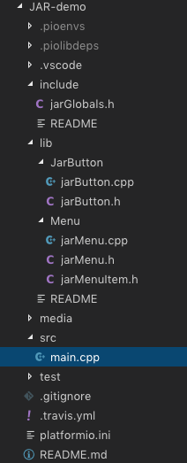

# JAR-demo
Test-repository for the JAR Project.  
This is to test the correct project setup for each developer. When using Visual Studio Code and the PlatformIO extension to code, compile and upload.  
Another test is to split the Pololu-Demo sketch into several files that can be compiled and uploaded with the PlatformIO extension.

## Project setup  
Before checkout create a new Pololu A-Start 32U4 project with the PlatformIO extension of Visual Studio Code:

Locate the project folder and then clone this repository into that folder.  

This is to enshure that all local dependencies in the project has the correct setup. PlatformIO genereates a .gitignore file where all local settings are inside.

The project folder looks now like this:  

## Refactoring of the Pololu-Demo sketch